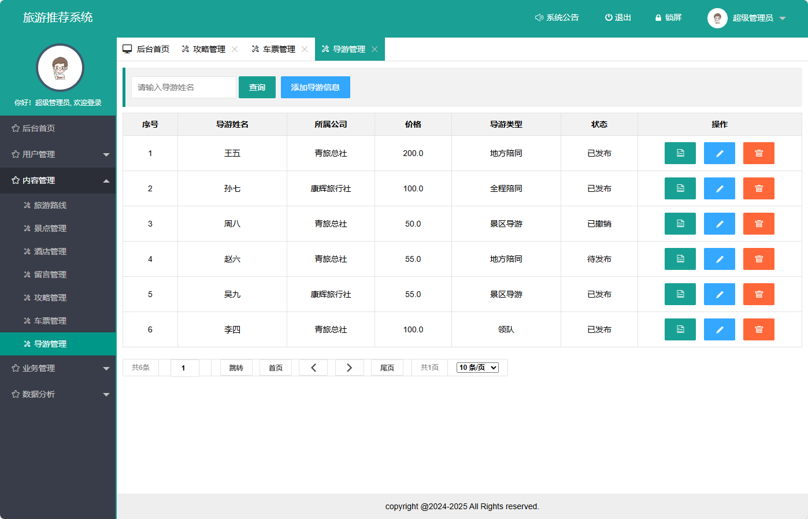

# 旅游推荐系统(文末免费领取☟)
> 
#### 介绍
旅游推荐系统(Java_SpringBoot)
有BUG可留言加微

#### 软件架构
Java + SpringBoot + Mybatis + Mysql

#### 项目功能说明

1.  管理员功能
> + 省份统计图
> + 用户管理：注册用户、系统用户（管理员、导游、旅店）
> + 内容管理：旅游路线、景点管理、酒店管理、留言管理、攻略管理、车票管理、导游管理
> + 业务管理：订单管理
> + 数据分析：用户分析、路线分析、景点分析、酒店分析、订单分析、攻略分析、车票分析、导游分析
2.  会员用户
> + 登录注册
> + 旅游路线
> + 旅游景点
> + 餐饮住宿
> + 旅游车票
> + 旅游导游
> + 旅游攻略
> + 注意事项
> + 会员中心：我的订单、我的留言、个人资料

### 部分功能演示

### 环境需求(可免费提供)
- idea/eclipse、jdk-1.8、maven-3.8.6、mysql、node.js等

## 有项目修改、安装调试需求 请联系以下

## 获取资源扫☝☝☝

